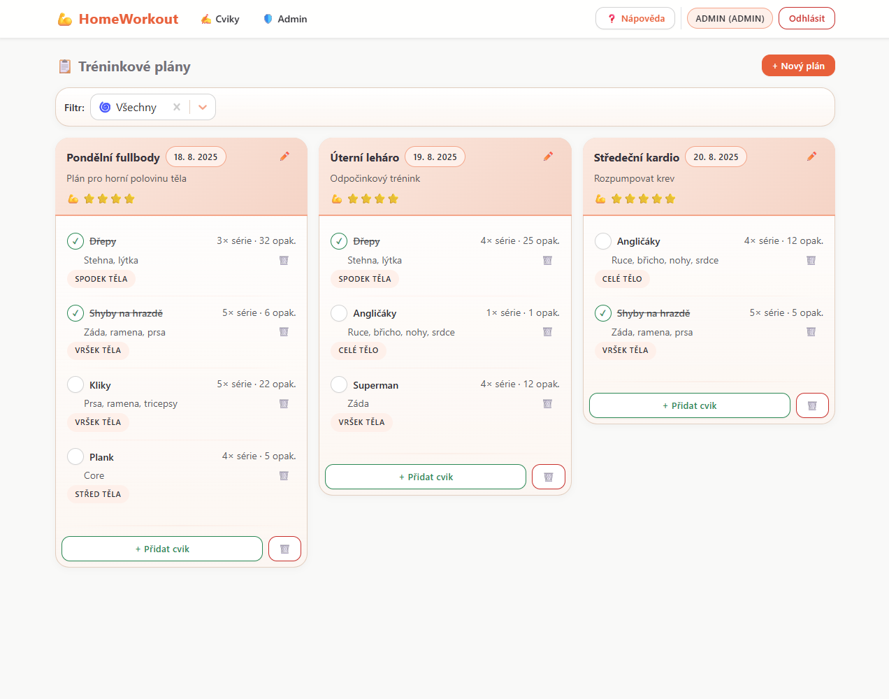
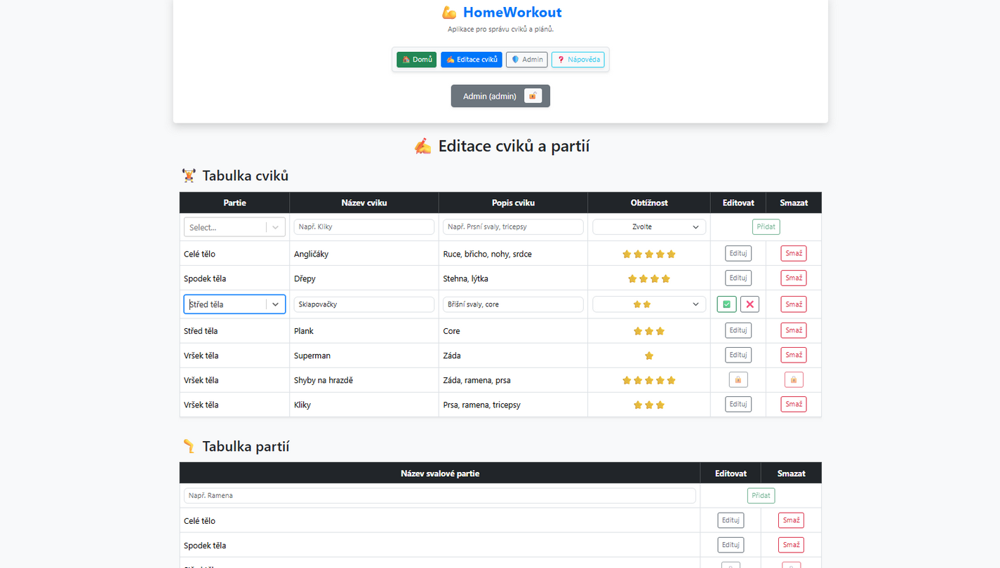
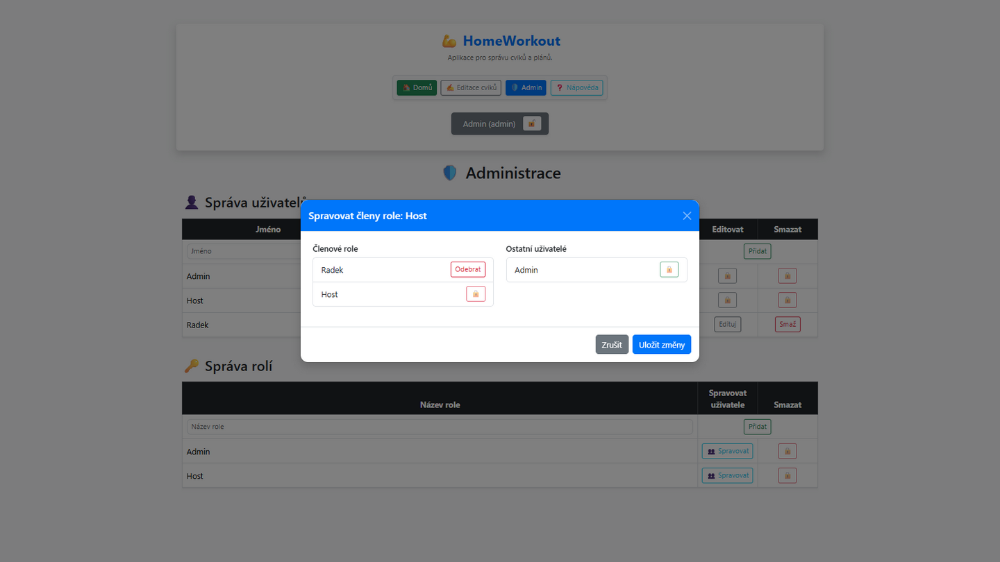
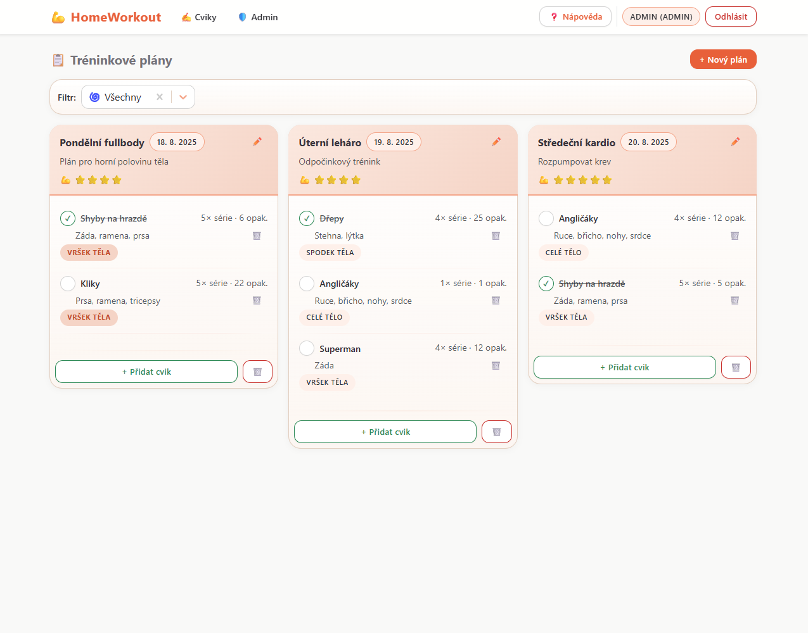

# HomeWorkout Aplikace

Tato mnou vytvořená aplikace slouží k vytváření, správě a optimalizaci denních cvičebních plánů. Uživatelé mohou přidávat cviky, označovat je jako "odcvičené" nebo je mazat. Aplikace má také administrační sekci pro správu cvičených partií a cviků, s možností role-based přístupu pro správu uživatelů a jejich práv.

## ✨ Hlavní funkce

- **Vytváření a správa denního cvičebního plánu**: Uživatelé mohou sestavit plán cvičení na každý den.
- **Filtrování cviků**: Podle toho, zda byly již odcvičené nebo neodcvičené.
- **Editace a smazání plánu**: Možnost upravit nebo zcela odstranit denní plán.
- **Označení cviku jako odcvičeného nebo jeho smazání**: Uživatelé mohou označit cviky jako dokončené nebo je odstranit.
- **Přidání nových cviků**: Možnost vložit nové cviky do plánu pomocí jednoduchého rozhraní.
- **Administrační sekce**:
  - **Správa cvičení a partií**: Přidávání, úpravy a mazání cvičení a svalových partií.
  - **Uzamčení položek**: Uzamčené položky nelze upravovat ani mazat, aby byla zachována jejich integrita.
  - **Formuláře**: Tlačítka pro přidávání položek jsou ve výchozím stavu deaktivována a aktivují se až po správném vyplnění povinných polí.

## 🛠️ Použité technologie

- **React**: JavaScript framework pro vytváření uživatelského rozhraní.
- **Axios**: Komunikace s API pro správu dat.
- **Vite**: Vývoj a optimalizaci aplikace.
- **ASP.NET Core Web API**: pro backend a API.
- **Azure**: Hostování backendu.
- **MonsterASP.NET**: Hostování MSSQL databáze.
- **Osobní webové stránky**: Hosting frontendové části aplikace.

## 👥 Role-based přístup

- **Admin**: Má plný přístup k administrativním sekcím, včetně správy uživatelů, cvičení a partií.
- **Host**: Má přístup k dennímu plánu a cvičením, ale nemůže upravovat administrativní data.
